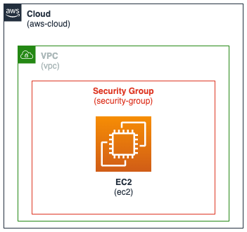

## {{Pattern Name}}
<p align="center">
       
</p>

### Core Concept
* Describe the concept at a high level

### Key Considerations
* List various considerations for this pattern
* Limitations
* Advantages
* Typical use cases

### Code Example
```
AWSTemplateFormatVersion: '2010-09-09'
Transform: AWS::Serverless-2016-10-31
Description: >
    sam-app
    Sample SAM Template for sam-app
# More info about Globals: https://github.com/awslabs/serverless-application-model/blob/master/docs/globals.rst
Globals:
    Function:
        Timeout: 20
        MemorySize: 512
        Environment: # More info about Env Vars: https://github.com/awslabs/serverless-application-model/blob/master/versions/2016-10-31.md#environment-object
          Variables:
            TABLE_NAME: !Ref OrdersTable
            ENDPOINT_OVERRIDE: ""

Resources:
  GetOrderFunction:
    Type: AWS::Serverless::Function # More info about Function Resource: https://github.com/awslabs/serverless-application-model/blob/master/versions/2016-10-31.md#awsserverlessfunction
    Properties:
      CodeUri: target/aws-sam-java-rest-1.0.0.jar
      Handler: com.amazonaws.handler.GetOrderHandler::handleRequest
      Runtime: java8
      Policies:
        - DynamoDBReadPolicy:
            TableName: !Ref OrdersTable
      Events:
        GetOrder:
          Type: Api # More info about API Event Source: https://github.com/awslabs/serverless-application-model/blob/master/versions/2016-10-31.md#api
          Properties:
            Path: /orders/{order_id}
            Method: get
```

### References
<a href="https://aws.amazon.com" target="_blank">Example Reference 1</a>

<a href="https://aws.amazon.com" target="_blank">Example Reference 2</a>


